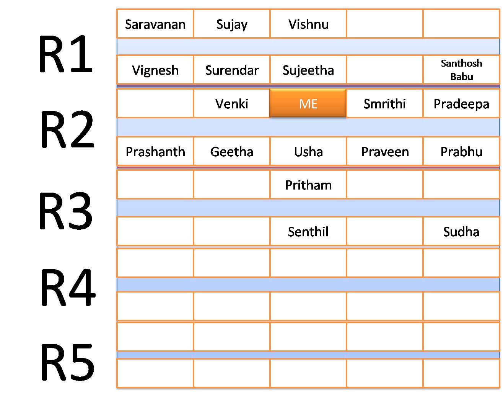

Hmmm.... Rendaavathu Post .. The Network Lab end-sem just got over by this friday\[Nov 2 \]. Annikku nadantha comedyllam kondu varrathukku thaan intha post ... First... lab oda layout onna naane pottirukken ...Enakku gnyabagam irukkara varaikkum yaarellam yengellam ukkanthu irunthanganu pottirukken ... Athaan ithu ..

Ippo matterukku varuvom ... The question given in our exam was to simulate the Go-Back-N Protocol ... Correct a exam porathukku munnadi thaan [Sivagami](http://www.dagense.blogspot.com/) Sliding Window Protocol podrathukku oru algo sonnan ... Nalla Vela sonnan .. Avan mattum atha sollalena annikku labla onnume senji irukka mudiyathu .. Ulla pona udane random orderla ukkara vechaanga .. En roll no munnadiye varum nrathu naala naan mudhallaye lab kulla poitten .. Enakku vantha seat Fig. la irukku . ;-) . Enakku pakkathula rendu seat ume initialla gaali a thaan irunthuthu .. Seri ethaavathu vishayam therinjavanga vantha oru support a irukkume . In Case of Emergency (Ethuvume Work aavaatha patchatula) usefulla irukkume nenachan .. Senthil vanthu ukkaruvaannu ethirpaathen .. Avan pakkathu row kku poittan ... Kadaisiya oru pakkam Venki vanthaan "_Machaan padichittiya_" nnu vanthaodane kettaan ... Naan sumaarathaan padichi irunthen .. Atha thaan sonnen .. Apparam antha pakkam Smrithi ... Appo than oru releif , ava night ellam ukkanthu padichiruppannu enakku theriyum . So kadisiyila ethavathu work aavama prachana panna ava kitta help kettukalaam nra nambikkaila prog start pannen .

Muthalla programla connection establish aana pothum nnu adichen .. Athu work aaiduchi .. So atha thaniya save panni vechuttu Siva sonna algo va gnyabagappaduthi paathen ... Vandha veraikkum adichen .. Suthama Work aagala .. Romba nerama yosicha apparam thaan thappu engannu kandu pidichen ... Test 3 manikku start aachu .. 5.30 kku mudikkanum .. Sliding Window work panna vekkarthukkulla pothum pothumnu aaiduchi .. Oru vazhiya etho onnu work aachu .. Seri ellarum enna panraangannu paakalaamnu thirumbi Senthila paatha , Etho verithanama type adichittu irunthan . Aduthu Smrithi ya paatha Thaniya Computer kuda etho pesittu iruntha .. Prashanth vazhakkam pola benchla thaalam pottuttu irunthaan ..

"_Last 15 mins_" nnu sonnanga Geetha Maam .. Seri athu varaikkum pannathu porum , kadaisi 15 nimishathula enna panni kizhikka poromnu sollittu , erkanave work aagittu iruntha Sliding Window prog a run pannaaa... Work aaagala ... Aapu .. Bind error .. Port maathinaalum work aagala .. Apparam ennamo maathi paathen kadaisiya work aaiduchi . Udane oru kural "_Switch off your monitors, times up_". Naanum off panniten ... Pakkathula Smrithi oda O/P paatha , pakkava questionla ketturukka formatla ye irunthuthu ... Ennodathum correct a work aagum , aana OP format vera .. Seri idhellam summa saadharna matter . Ithukkapparam varrathu thaan intha post ezhutharthukke kaaranamaana vishayam ...

Mothama OP pakkara staff naalu per .. Geetha Maam, Shiloah Maam, Prabhu Sir, and Bald Sir(I dunno his name so inime avara B Sir nnu kupidlaam). Antha laabla mark vangathukku 40% namma prog kaaranam meethi irukka 60% yaar OP paaka varaangannrathu thaan .. Intha staff laye Geetha maam thaan romba strictu ... Avunga enga side a vanthira koodathunnu vendittu irunthen ... Athe maathiri avunga correcta opposite side la irunthu start pannanga ... Theliva sola pona ... R4... Naan irukkarthuR2 .. So antha maam inga vara chance illa nnu nechu konjam relax aanen .. Adutha releif Prabhu Sir R1 la irunthu start pannathu .. Avar romba nalla sir .. Mark nalla poduvaaru .. Athanaala seri oru row thaane... namakku sure a avar thaan nnu nambi ukkanthuttu irunthen ... Solla pona enga row mothama ore kushiya irunthaanga ... Shiloah maam R5 la start pannanga .. Avunga vanthaa kuda paravaalla ... Appo thideernu B Sir enga Rowla Prashanth le iruthu start pannaru ... Mixed emotions ... My order of preference (In fact anyone's order of preference) was 1. Prabhu 2. B 3. Shiloah 4. Geetha maam thaan ... Seri .. B sir nna paravalla ... Worst Case namakku Shiloah maam thaan varuvaanga .. Eppadi yum prachana illennu nenachun ..Naan ethirpaathathu anyone except Geetha maam ...

Aana naama onnu nenacha theivam onnu nenaikkum nu solluvaanga .. Atha naan annikku thaan paathen ... Naan Mooonu nenachen .. Theivam athellam vittuttu 4nnu nenachirukku ... Prabhu Sir was taking almost 10-15 mins for each person. Sema kadupadaichittu irunthaaru .. Seri oru pakkam Prabhu sir, innoru pakkam B sir .. Ethavathu oru sir kitta kamichidalaamnra nambikka irunthuthu ... Prabhu sir 5 pera mudikkarthukkulla Shiloah maamum Geetha maamum 10 10 per mudichiruppanga ... Geetha maam ellarayum pudichi kathu kathunnu kathittu irunthaanga ... "_Ithu kooda poda theriyaama enna panreenga_". Enakku oru santhosham , namakku thaan avanga vara porathu illaye .. Ellarum nalla thittu vangungannu ...

Apparam senthiloda turn vanthuthu .. Geetha maam :-) . Sema kaththu .. Enna aachinnu appo theriyala ... Meanwhile B sir enga rowla rendu perukku than paathu irunthaar .. Prashant , Geetha ... Innoru pakkam prabhu sirR1 la ellarukkum mudichittaru .. Saravananum Sujayyum than baakki ... So appo oru calc pannen ... Prabhu sir oda current positionla irunthu 5 aavathu aal naan , B sir kkum athe 5 thaan ... Geetha maam apppo R4 mudichittu R3 mukkavasi mudichittanga ...

Thideernu B Sir order maari vanthu Venkat kitta "_ya switch on your monitor_" nnaru ... Oh .. very good Avanukkadutha namma thaan nnu nenachittu irunthen ... innoru bonus vera .. Antha sir namma ethavathu code pannalenna kuda "_Write down the logic_ " appadinnu sonnaru .. Enakku ore gujaaltiya aaidichu .. Inikku eppadi irunthaalum nalla marks vaangidallam nu oru abaara nambikka vanthudichi ...

Appo time 6.20 irukkum .. Smrithi vera "_Naan poi avarkitta LG veetukku poganumnu sollittu kelamba poren_" nnu sollittu iruntha . Nan kuda solla maataanu paathaaaaa.. Gabaalnu ezhunthu poi "_Sir, Naan enga LG ya 6.30 kku meet pannanum sir .. So enakku OP check pannunga please_" nna ... Sir udane ok sollitaaru .. "_LG na Local Guardiana maa_" "_Aamam sir_". _"Where are u from ? " "Neyveli Sir_" .. Itha sollum bothellam paakanume Appadiye onnum theriyatha maathiri oru moonji.. Athukkulla atha enga irunthu vaanginaalo ... Venkatukku paathachu .. Ippo smrithikkum Op check pannittu irukkaru .. Athu yaaru .. Naan thaaan .. Ippadi paatha .. Prabhu Sir vanthaaru ... Vanthuttu "_Sir , neenga intha row mudichidunga.. Naan antha pakkam poren_" nnu sollittu escape aaittaru ..

Pona poguthu .. naan B sir kitta "_Sir OP paakareengala, OP paakareengala_"nnu etho bomma vikkara maathiri sollitte irunthen .. Avar mathikkave illa .. Smrithikku correction pannum bothu oru phone call vera "_Aan , sollunga, naan third floor labla thaan irukken .. Busy .. apparam pesalaam_" ippadi aarambichu romba neram pesittaru .. Naan ethechaya Geetha maam enga irukkangannu thirumbi paatha .... She finished that R3 and was coming to our row .. "_Enna Sir , intha row overa?_" .. "_Aan illa madam antha kadaisi machine paakala_" nnu pratheeba machine a kaamicharu. .. maam anga poittangau .. Sir intha timela Smrithi exec paathuttu ava kitta 2nd ques logic exhutha sollittu , en kitta varaama nera Praveen kitta poittaru ..

Avar en zigzag route eduthaarne enakku puriyala .. Antha rowla innum irukkarthu naanum prabhu vum thaan ... Sir prabhu kitta pona maam enkitta vanthiruvaaanga .. Athanaala "_Sir Sir_ "nnu kooptu kooptu paathen ... madhikkave illa ..Prabhu vera "_Dei Dei pls da naan sir kitta kaamikkaren_"nnu kettuttte irunthaan .. Kadaisiya naan ethu nadakkave nadakkathunnu nenachano correcta athuthaan nadanthuthu ..Sir prabhu kitta ponaru , maam enkitta vanthu "_ya show ur OP_"nnanga. Smrthi eppayo kelambitta ... Naan paathappo antha sir prabhu Pc la irunthuttu ennaye paathuttu irunthaaru ...

Odane maam kitta enakku vantha OP a kaamichen .. "_Enna paa . Automatic a kudukkartha ellam nee manual IP a kuduthirukka_" nnanga .. Naan summave irunthen .. Working kaaamichen .. Correct u ... Shew..Maam othukittanga ... So first questionukku oru tick adicittu "_Second pottiya_" nnu kettanga .. "_Maam , actually ithu podrathukku romba time aaiduchi athunaala podala_ " nnu thenavatta sonnen (Enna Firstu thaan correcte .. He he ).. Maamum poittanga ...

Eppadiyo nalla badiya mudinjirichunnu paatha .. Oda B Sir vanthaaru . "_Enna paa , maam enna sonnanga?_" _"Athu onnum illa sir , first one correctu"_. Appo onnu sonnaru paarunag .. Ada Ada .. Kekkave nalla irunthuthu.."_Enakku theriyum pa , nee konjamaavathu pottiruppannu . Athaan untha paakala . Illana mudhallaye paathruppen ."_ itha ketta udane ore sirippu .. Enna poi .. Nalla pannuvennu eppadinenachaarne theriyala .. Enna en assess markellam romba kevalam .. 8, 11 .. Sem mattum ozhunga panni illa na aapu thaan ..

Ivlo periya kadhaila irunthu naan enna solla varenna .. Vaippe illa nnu nenacha oru vishayam .. Correct a center panni vayithulaye ongi kuthittu poidichu .. So .. Ethayume ethirpaaka kudathu .. Varratha vechikkanum .. "_Kedaikkarthu Kedaikkama irukkathu . Kediakkama irukkarthu Kedaikkathu_" enra thalaivar pon mozhi ya sollittu naan appete aaikkaren .. yappa .. Enakke itha padichu paatha bore adikkuthuda saami ..
