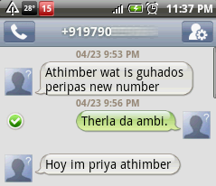

It was a pleasant evening in Besant Nagar beach. Vignesh had come from Bangalore and Me, [Vignesh](http://twitter.com/#!/vignesh_p) and [Senthil](http://twitter.com/#!/_SenthilKumar) were lazily walking in the beach after a _full kattu_ at [Mash](http://chennai.burrp.com/listing/mash_besant-nagar_chennai_restaurants/134848475__AB##listing). Talking intellectually about the matters boys usually speak. Starting from Politics touching a little bit of cinema and ending at Figures in each of our offices. It was all going well until i got this message from an unknown number. Initially i wasn't suspicious and I really thought it was a wrong message. But the language in the message made me a little suspicious. I thought maybe some friend of mine is so vetti on a Saturday Evening and wanted to play a game with me. All right. I decided to jump in. But was still a little too skeptical and thought there is 90% chance that it was actually a wrong message. Anyways i replied.

At this point i wasn't expecting a reply incase it was actually a wrong message. Or was expecting some rage reply from the guy :) . Anything but certainly not this.

Ha. Now i was sure that it was one of my friends. If the '_Hoy_' and '_Athimber_' _Iyer Bashai_ wasn't enough, the name Priya was a big let down. It is the most commonest name in Tamil Girldom. 'Idiot cant even think of a better name' i thought to myself. I was fully into the mood by this time. We discussed among us and came into conclusion for the next reply. Then it went....

The next reply was a lame one. We were puzzled. We were thinking of the remote possibility that it might actually be some _Iyer Aathu Priya_. Then we came back to our senses. '_Evano namma kooda vilayadran' 'Vida koodathu_'.

We were ROFLMAO ing by now. Whoever is doing this must be very good in timing i thought. We were 99% sure that it was a prank. Coz

1\. Nobody talks like that on messages

2\. If at all it is a girl, she should have figured that i am not her _athimber_ by now with the crap I am talking

3\. Who changes number when they go to trichy?

So i was thinking of sending a strong _brahmastra_ to bring the guy to his knees. Then i sent ...Okay.. I was a little freaked out now seeing that reply. No one can be this lame. And i dont have time for pranks. So i called the number. I was expecting a '_Machi_' or a group of guys laughing or even a '_Unakku Piriya kekkutha, Piriya_' ... But it was a GIRL who said Hello and then it went '_Aaan, Sollunga Athimber_'. It.was.a.GIRLLL.

I had no idea what to do. I was yelling hello, hello just to find out whether it was still a prank and if the girl started laughing. Nothing happened. I thought she would figure out from my voice that i am not her _athimber_. That didnt happen either. She was repeating the same thing. \*Beeep\* . There.. I hung up. And Vignesh and Senthil were laughing uncontrollably looking at my facial expression. Many things such as Police, Cyber Crime, Eve Teasing were running in my head. Then i thought '_Thoo, ithu sappa matter da. Not worth eve teasing_' . Now my 99 % of Prank call chance went to below 1 %. Okay one last message i thought and sent.

That is the funniest sms conversation i've ever had in my life. I can never forget Priya, her athimber who strangely has the same mobile number as me and most importantly Guhados Periyappa who went on a tour to trichy with someone to visit _Perumaal_.
