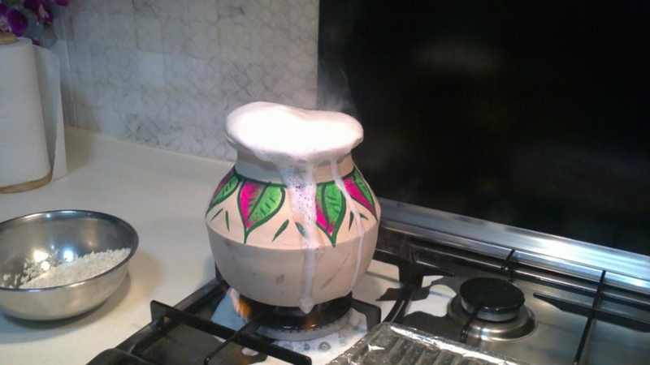

பள்ளி பருவத்தில் என்னிடம் யாராவது "_உனக்கு பிடித்த பண்டிகை எது_?" என்று கேட்டால் யோசிக்காமல் தீபாவளி என்று சொல்லுவேன். பட்டாசு, வானவேடிக்கை, பலகாரம் என்று என்ன இல்லை தீபாவளியிடம். ஆனால் சற்றே வளர்ந்தவுடன், பொங்கலின் அருமை தெரிய ஆரம்பித்தது. அதுவும் இப்பொழுது வீட்டை விட்டு பல ஆயிரம் கிலோமீட்டர்கள் தொலைவில் இருக்கையில், முன்பிருந்தவாறு பொங்கலை கொண்டாட உள்ளம் ஏங்குகிறது. பொங்கல் வருவதற்கு முன் வாரமே வீடு சுத்தம் செய்யும் பணிகள் தொடங்கி விடும். அந்த வாரத்தில் ஒரு நாள் எங்கள் வீட்டருகில் உள்ள ஒரு கடைக்கு சென்று பொங்கல் வாழ்த்து மடல்கள் வாங்கி என் நண்பர்களுக்கு அனுப்புவேன். என்னதான் அவர்கள் வீடு பக்கத்துக்கு தெருவில் இருந்தாலும், ஸ்டாம்ப் ஒட்டி தபாலில் தான் அனுப்புவேன். அனுப்பிவிட்டு அடுத்த நாள் பள்ளிக்கு சென்று "_கிரீட்டிங் கார்டு வந்துதா டா?_" என்று பெருமையாக விசாரிப்பது வேற.

தீபாவளியின் மவுசு மிஞ்சி போனால் இரண்டு நாட்களில் ஓய்ந்து விடும். ஆனால் எங்கள் வீட்டில் பொங்கல் ஒரு முழு பேக்கேஜ். _போர் நயிட்ஸ், திரீ டேஸ்_ என களைகட்டும். முதல் நாள் போகி க்கு முன்னரே ஆளுக்கு ஒரு போகி மேளம் வாங்கி வருவோம். அதில் என் பெரியப்பா வண்ண வண்ண படங்கள் வரைந்து அவரவர் பெயரை எழுதி தருவார். போகி அன்று காலை 5 மணிக்கு அம்மா எழுப்பும் முன்னரே அக்கம் பக்கத்தில் மேள சத்தம் தட்டி எழுப்பும். முன் கூட்டியே சேகரித்து வைத்திருந்த காய்ந்த ஓலைகள், காகிதங்கள் இதர பொருட்களை வீட்டின் முன் வைத்து கொளுத்தி அதில் அந்த மேளத்தை சூடேற்றி அடித்து மகிழ்வோம். அதில் தெருவில் யார் தீ உயர எறிகின்றதுன்னு போட்டி வேற. போகி கொளுத்தி முடித்தபின் அம்மா அந்த இடத்தை சுத்தம் செய்து அழகிய கோலமிடுவாள். அன்று எனக்கு பெரிய வேலை எதுவும் இல்லை. டீவியில் "_காட்டுக்குயிலு மனசுக்குள்ள_ "மற்றும் "_தை பொங்கலும் பொங்குது_" பாடல்களை ஆயிரம் தடவை கேட்பது மட்டும் தான்.

<figure>

<figcaption>

Image Courtesy: [Dinamalar](https://www.dinamalar.com/news_detail.asp?id=2456553&Print=1)

</figcaption>

</figure>

பெரும் பொங்கலன்று காலை என் தந்தையுடன் கடை தெருவுக்கு சென்று கரும்பு உட்பட அணைத்து அயிட்டங்களையும் வாங்கிக்கொண்டு வருவேன். அம்மா வெண்பொங்கல், சர்க்கரை பொங்கல், வடை, பொங்கல் குழம்பு என்று ஒரு விருந்தே சமைக்க, பொங்கல் பொங்கி வரும்பொழுது அனைவரும் சமைலறையில் ஒரு '_பொங்கலோ பொங்கல்_' போடுவோம். சூரியனுக்கு அனைத்தையும் படைத்து விட்டு, காக்கைக்கு வடையை வைத்து நான் காக்காய் மாதிரி கத்த என் தங்கை சொந்த குரலிலே பாடியே காக்கையை வரவழைப்பாள். படையல் சீக்கிரம் வைத்தால் தான் காக்காவை கவர முடியும், கொஞ்சம் லேட் ஆனால் கூட ஏரியா காக்கைகள் ஏற்கனவே புல் கட்டு கட்டி மிதப்பில் இருக்கும், வராது. பொங்கலுக்கு "_ஸ்லீப்பிங் டோஸ்_" என்பது எத்தனை பொருத்தமான பெயர். சாப்பிட்டு ஓரிரு மணி நேரத்தில் வீட்டில் அத்தனை விக்கெட்டும் அவுட் ஆகிவிடும். ஒரு மூணு மணி வாக்கில் வீட்டில் இருக்கும் கரும்பை கடித்து உரிய ஆரம்பித்தால் மாலை சிறப்பு திரைப்படம் ஆரம்பிக்கும் வரை ஓடும்.

<figure>

<figcaption>

Image Courtesy: [ராஜா சபை](http://rajasabai.blogspot.com/2012/01/blog-post.html)

</figcaption>

</figure>

என் தாத்தா பிறந்த கிராமம் சென்னைக்கு மிக அருகில் என்றதால், பொங்கலுக்கு ஒவ்வொரு வருடமும் தவறாமல் அங்கே செல்வோம். பொங்கல் இரவு தங்குவது அங்கே தான். வைக்கோல் போட்டு அதற்க்கு மேல பாய் விரித்து தூங்குவதே ஒரு தனி சுகம். கிராமத்தில் மாட்டு பொங்கல் கூடுதல் குஷி தான். காலையில் எழுந்தவுடன் பம்புசெட்டில் குளியல். 10 நிமிடம் குளித்துவிட்டு ஒரு மணி நேரம் ஆட்டம் போட்டுவிட்டு களைப்பாக வீட்டுக்கு வந்தால் இட்லியும் கறிகுழம்பும். எட்டு பத்து இட்லிகளை லாவகமாக விழுங்கி விட்டு ஊரை சுற்றி ஒரு ரவுண்டு போய் வருவோம். மாலை 5 மணி வாக்கில் ஊரை சுற்றி மூன்று முறை மேளம் அடித்து மாடு விரட்டு துவங்குவதற்கு நோட்டிபிகேஷன் குடுத்து செல்வார்கள். ஊர் முழுவதும் உள்ள மாடுகள், மாட்டு வண்டிகள் அழகாக அலங்கரிக்கப்பட்டு ஊர் நடுவில் உள்ள கோவில் மைதானத்தில் ஓட்டிக் கொண்டு அணிவகுப்பதை பார்க்க ஆவலாக செல்வோம். மாடு விரட்டு முடிந்த கையோடு இரவு கிளம்பி விடுவோம். ஏனெனில் அடுத்த நாளுக்கான திட்டங்களை முன்கூட்டியே போட்டு வைத்திருப்போம்.

<figure>

<figcaption>

Image Courtesy [அம்‌மச்‌சி‌க்‌கோ‌யி‌ல்‌](http://ammachikoil.blogspot.com/2010/02/ammachkoil-photo-gallery.html) 

</figcaption>

</figure>

காணும் பொங்கலுக்கு போடுகிற முதல் பிளான் வழக்கம் போல சோறு தான். சித்தப்பா வீடு , பெரியப்பா வீடு என்று மொத்தம் பதினாறு டிக்கெட். புளியோதரை, தக்காளி சாதம் என்று வழக்கமான உணவாக இருந்தாலும் குடும்பத்தோடு மர நிழலில் ஜமுக்காளம் விரித்து பகிர்ந்து உண்பது ஒரு தனி அனுபவம். ஒரு வேன் புக் செய்து உணவு கட்டிக்கொண்டு வண்டலூர் பூங்கா, மஹாபலிபுரம் என்று வருடம் ஒரு இடம். அடுத்த நாள் '_அலைமோதிய கூட்டம்_' என்று தினத்தந்தியில் வரும் புகைப்படத்தில் நாங்கள் இருக்கிறோமா என்று தேடிய காலங்களும் உண்டு. ஒரு வழியாக ஆட்டம் போட்டு, கடற்கரையில் விளையாடி வீடு வந்து சேர இரவு ஆகி விடும். நான்கு நாள் கொண்டாட்டத்திற்கு பிறகு அடுத்த நாள் பள்ளி போகவேண்டும் என்பது இன்னொரு கொடுமை. இவ்வளவு ஆசையாக கொண்டாடிய பண்டிகையின் நினைவுகள் இறுதி வரை மனதில் இருந்து நீங்காது !
