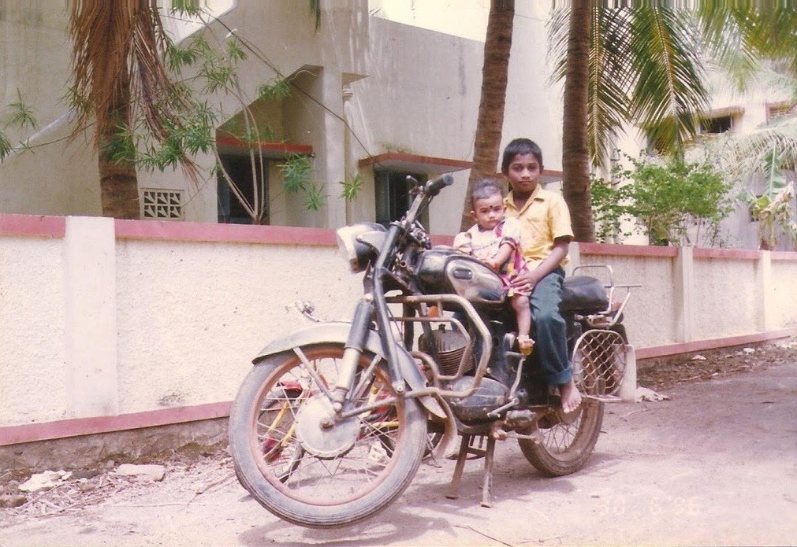

இன்று வீதிக்கு ரெண்டு ராயல் என்பீல்ட் வண்டி இருப்பது போல அல்ல அன்று. 80களிலும் , 90களிலும் புல்லட் வண்டி என்பது அரிது மற்றும் ஒரு தனி அடையாளமும் கூட. தற்கால சொல்லாடடில் சொல்ல போனால் "_ராயல் என்பீல்ட் இஸ் எ நேம், புல்லட் இஸ் ஆன் எமோஷன்_" என்றே சொல்லலாம். இன்றும் சினிமாக்களில் ஒரு மிராசையோ, மைனரையோ காட்டினால், ஒரு புல்லட் வண்டியில், கைப்பிடிகளின் இருபுறமும் ரிப்பன்கள் கட்டி, கலர் சட்டை அணிந்து, கருப்புக் கண்ணாடி போட்டு ரோட்டில் மெதுவாகப் பவனி வருவது போல் காட்டுவது வழக்கம். ஏனெனில் அந்த வண்டிகளில் வேகமோ, வளைந்து நெளிந்து வரும் லாவகமோ இல்லை. படைவீரர்கள் பாய்ந்து வரும் குதிரைகள் போலல்ல புல்லட்டுகள், அரசர்கள் அம்பாரியோடு அமர்ந்து வரும் யானைகள் அவை.

என் அப்பா எந்த விதத்திலும் ஆஜானுபாகுவான மனிதர் இல்லை. சராசரி உயரம், மெல்லிய தோற்றம். கைகளை மட்டும் தண்டால் எடுத்து புஷ்டியாக வைத்திருப்பார். குரலும் சிம்மகர்ஜனை என்றெல்லாம் சொல்லிவிட முடியாது. மிட்டா மிராசும் இல்லை, ஜமீன்தாரும் இல்லை. ஆனால் அந்த புல்லட்டில் அமர்ந்து, சைடு ஸ்டாண்டை எடுத்து ஒரு உதை உதைத்து ஸ்டார்ட் பண்ண பின்பு வேறு மனிதர் ஆகிவிடுவார். அதிலும் சில நாட்கள் சபாரி உடை அணிந்து சென்றால் ஏதோ கருப்பு பூனை படையில் இருப்பது போன்ற தோரணை சேர்ந்து விடும். புல்லட் வண்டிகளின் தோற்றத்தை விட அதி முக்கியமான ஒரு அம்சம் உண்டு. அது தான் அவை போடும் சத்தம். டுபு டுபு டுபு என்று அப்பாவின் வண்டி தெருமுனையில் வரும்போதே வீட்டில் சத்தம் கேட்டு விடும். அரக்கப் பறக்க அவரை பார்க்க ஆவலாய் வாசலுக்கு ஓடுவேன். என்னைத் தூக்கி வண்டியின் முன்பகுதியில் பெட்ரோல் டேங்க் மீது உட்கார வைத்து ஒரு ரவுண்டு கூட்டிட்டு போவார். அப்பாவின் கைமேலே நானும் பிடித்துக்கொண்டு ஏதோ நானே புல்லட் ஓட்டுவது போல் பாவனை செய்து போவேன் . 

ஆரம்ப பள்ளிக்குச் செல்லும் போது பெரும்பாலும் என்னை அப்பா தான் கூட்டிக்கொண்டு விடுவார். வழக்கம் போல என்னை முன்னாடி உட்காரவைத்து பள்ளி போகும் வழியில் பேசிக்கொண்டே போவோம். முக்கியமாக எனக்கு அந்த நேரத்தில் திருக்குறள் சொல்லிக்கொடுத்துக் கூட்டிட்டு போவார். தமிழ் பாடத்தில் வருவதற்கு முன்னரே நிறைய குறள்கள் அப்பாவின் புல்லட்டில் தான் நான் கற்றுக்கொண்டேன். சிறு வயது முதலே எனக்குத் தமிழ் ஆர்வம் வந்ததற்கு அப்பாவும் புல்லட்டும் மிக முக்கிய காரணிகள். அது மட்டுமின்றி பள்ளிக்கு நண்பர்கள் மத்தியில் பந்தாவாக புல்லட்டில் அப்பாவுடன் வந்து இறங்குவது ஒரு தனி குஷி தான். வீட்டில் ஸ்டாண்ட் போட்டு வண்டி நிற்கும் பொழுது, கால் எட்டாத போதும் டுர் டுர் என வாயிலே சத்தம் போட்டு ஹேண்டில்பாரை அங்கும் அங்கும் திருப்பி விளையாடுவேன். பொம்மைகள் வைத்து விளையாடிக்கொண்டிருக்கும் தங்கையையும் வலுக்கட்டாயமாகக் கூட்டிக் கொண்டு வண்டியில் வைத்து 'ரவுண்டு' கூட்டிட்டு போவதாக சொல்லுவேன்.

ஒருவர் தனது வண்டியின் மேல் வைத்துள்ள பற்றை ஓட்டுவதில் மட்டும் உணர்ந்துவிட முடியாது. அவர்கள் வண்டியை பராமரிக்கும் முறையில் தான் அது வெகுவாக தெரியும். நேரம் கிடைக்கும்போதெல்லாம் ஒரு சின்ன முக்காலியையும், பக்கெட் தண்ணியையும் எடுத்துக்கொண்டு வண்டி அருகே அமர்ந்து விடுவார் அப்பா. அதைத் தேய்த்துத் துடைத்து பளபளவென வைத்துக்கொள்வார். "_நாளப்பின்ன உனக்கும் நல்ல வண்டி வேணும்னா நீயும் வந்து உன் சைக்கிள துடை_" என்பார். நானோ ஆயுத பூஜைக்கு மட்டுமே வண்டியை அதுவும் வேண்டாவெறுப்பாய் துடைக்கும் கேஸ். துடைப்பது மட்டுமின்றி அதனை அவ்வப்போது செப்பனிட்டு வைப்பது ஒரு பெரிய போராட்டம். "_மெக்கானிக் பூரா திருட்டு பயலா இருக்கானுங்க. போன தடவ வண்டிய விட்டுட்டு வந்தேன், நாசமாக்கி வெச்சிருக்கான்_" என அடிக்கடி புலம்பி ஏழெட்டு மெக்கானிக் மாற்றுவார். 

அப்பாவின் புல்லட் பந்தம் அவர் வேலை நிமித்தமாக சில வருடங்கள் வங்கியின் கிராம கிளைக்கு மேலாளராக  சென்றபோதும் விடவில்லை. அங்கே அவர் பயன்படுத்த ஒரு பழைய புல்லட் வண்டி கொடுத்தார்கள். கிராமத்தில் சின்ராசு கணக்காக அதனை ஓட்டிக்கொண்டு திரிந்திருந்தார். வீட்டில் இருந்த அவரது வண்டியை பல வருடம் கழித்து விற்க நேர்ந்தது. அதனை விற்ற பின்பும் அதே போல ஒரு வாட்ட சாட்டமான பெரிய வண்டியை தான் வாங்கினார் அப்பா. நான் வாங்கிய முதல் வண்டியிலிருந்து, இன்று பயன்படுத்தும் கார் வரையிலும் அப்பாவின் புல்லட்டின் சாயல் கண்டிப்பாக இருக்கும்.  வெளிநாட்டில் இன்றும் ரோட்டில் டுபு டுபு என்று ஹார்லீ டேவிட்சன் வண்டியில் நீண்ட வெள்ளை தாடி வைத்து பைக்கர் கேங்க் ஆட்கள் யாரேனும் சென்றால், எனக்கு முதலில் நினைவிற்கு வருவது திருவள்ளுவர் தான். தாடியினால் அல்ல, என் டாடியினால்.
